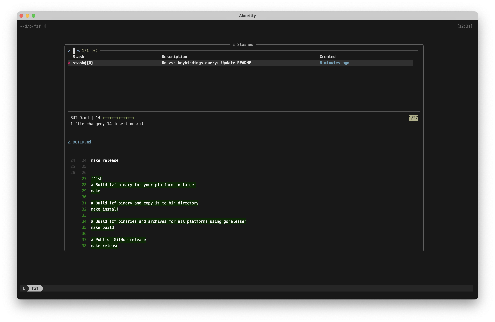

# fzf-fish

Keyboard bindings and widgets for `fish` shell using `fzf`.

## Widgets

### Git branches

- **Key binding:** <kbd>Ctrl</kbd>+<kbd>G</kbd> <kbd>Ctrl</kbd>+<kbd>B</kbd>
- **Mnemonic:** **G**it **B**ranches
- **Options:**
  - Show **h**elp: <kbd>Ctrl</kbd>+<kbd>H</kbd>
  - Toggle between local/**a**ll branches: <kbd>Ctrl</kbd>+<kbd>A</kbd>
  - Check**o**ut branch: <kbd>Ctrl</kbd>+<kbd>O</kbd>
  - **B**rowse branch in GitHub: <kbd>Ctrl</kbd>+<kbd>B</kbd>
  - Select/deselect branch: <kbd>Tab</kbd> / <kbd>Shift</kbd>+<kbd>Tab</kbd>
- **Output:** Space-separated names of selected branches


### Git log

- **Key binding:** <kbd>Ctrl</kbd>+<kbd>G</kbd> <kbd>Ctrl</kbd>+<kbd>L</kbd>
- **Mnemonic:** **G**it **L**og
- **Options:**
  - Select/deselect commit: <kbd>Tab</kbd> / <kbd>Shift</kbd>+<kbd>Tab</kbd>
- **Output:** Space-separated hashes of selected commits


### Git stashes

- **Key binding:** <kbd>Ctrl</kbd>+<kbd>G</kbd> <kbd>Ctrl</kbd>+<kbd>T</kbd>
- **Mnemonic:** **G**it S**t**ashes
- **Options:**
  - Drop stash: <kbd>Ctrl</kbd>+<kbd>X</kbd>
  - Select/deselect stash: <kbd>Tab</kbd> / <kbd>Shift</kbd>+<kbd>Tab</kbd>
- **Output:** Space-separated refs of selected stashes



### GitHub PRs

- **Key binding:** <kbd>Ctrl</kbd>+<kbd>G</kbd> <kbd>Ctrl</kbd>+<kbd>P</kbd>
- **Mnemonic:** **G**itHub **P**ull requests
- **Options:**
  - Show **h**elp: <kbd>Ctrl</kbd>+<kbd>H</kbd>
  - Switch through PR s**t**ates: <kbd>Ctrl</kbd>+<kbd>T</kbd> / <kbd>Ctrl</kbd>+<kbd>Alt</kbd><kbd>T</kbd>
  - Switch through result **l**limits: <kbd>Ctrl</kbd>+<kbd>L</kbd> / <kbd>Ctrl</kbd>+<kbd>Alt</kbd><kbd>L</kbd>
  - Select/deselect PR: <kbd>Tab</kbd> / <kbd>Shift</kbd>+<kbd>Tab</kbd>
- **Output:** Space-separated numbers of selected PRs


### GitHub repos

- **Key binding:** <kbd>Ctrl</kbd>+<kbd>G</kbd> <kbd>Ctrl</kbd>+<kbd>R</kbd>
- **Mnemonic:** **G**itHub **R**epositories
- **Options:**
  - Show **h**elp: <kbd>Ctrl</kbd>+<kbd>H</kbd>
  - Switch through repository or**g**anizations: <kbd>Ctrl</kbd>+<kbd>G</kbd> / <kbd>Ctrl</kbd>+<kbd>Alt</kbd><kbd>G</kbd>
  - Switch through result **l**limits: <kbd>Ctrl</kbd>+<kbd>L</kbd> / <kbd>Ctrl</kbd>+<kbd>Alt</kbd><kbd>L</kbd>
  - Select/deselect repo: <kbd>Tab</kbd> / <kbd>Shift</kbd>+<kbd>Tab</kbd>
- **Output:** Space-separated names of selected repos


## Install

```fish
fisher install edosrecki/fzf-fish
```

## Configuration

Check [`conf.d/fzf_widgets.fish`](conf.d/fzf_widgets.fish) for available options.

## Recommendations

- `brew install util-linux` to get better [`column`](./functions/__fzf_column.fish) command
- `brew install git-delta` to get better [git diff](./functions/__fzf_delta.fish) output
